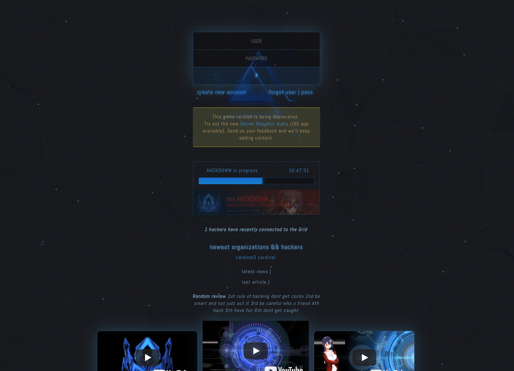
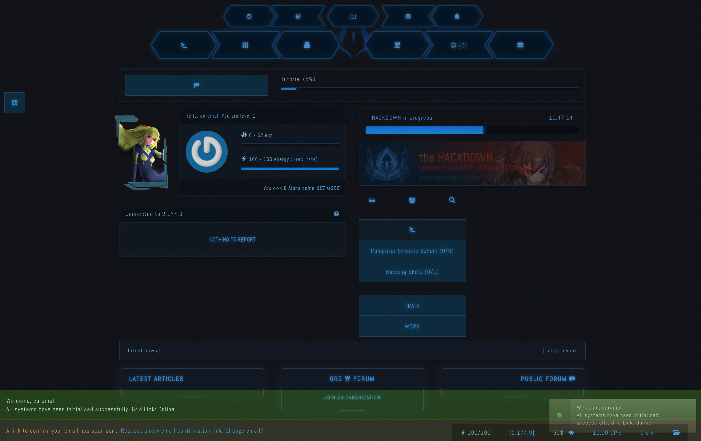
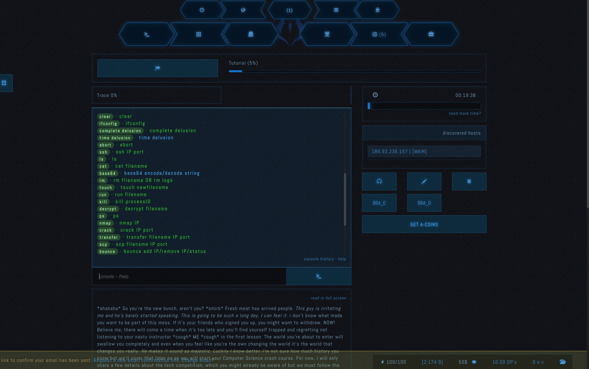
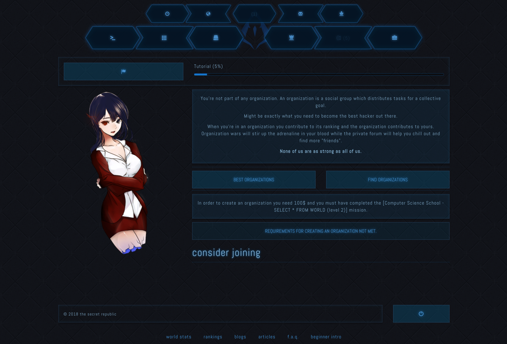
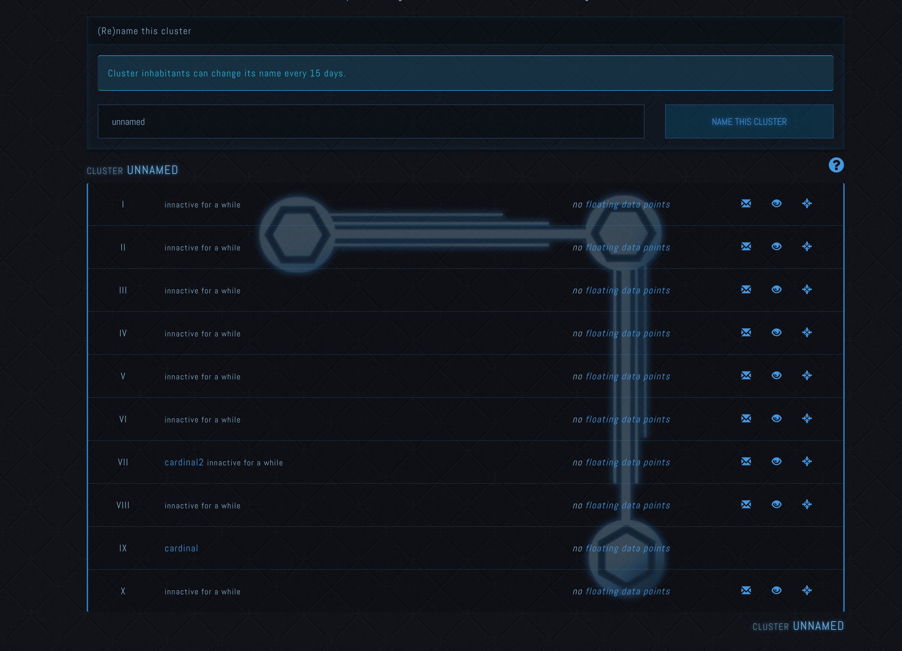
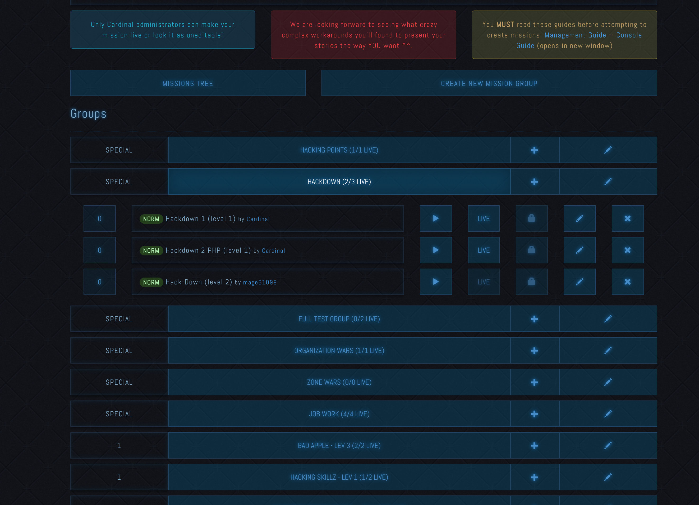
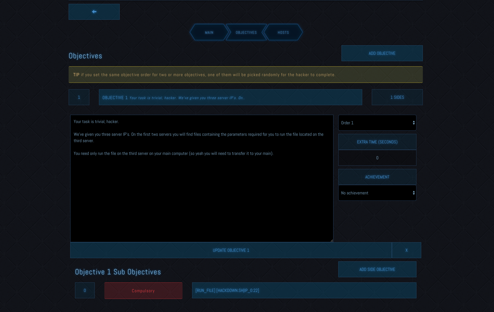
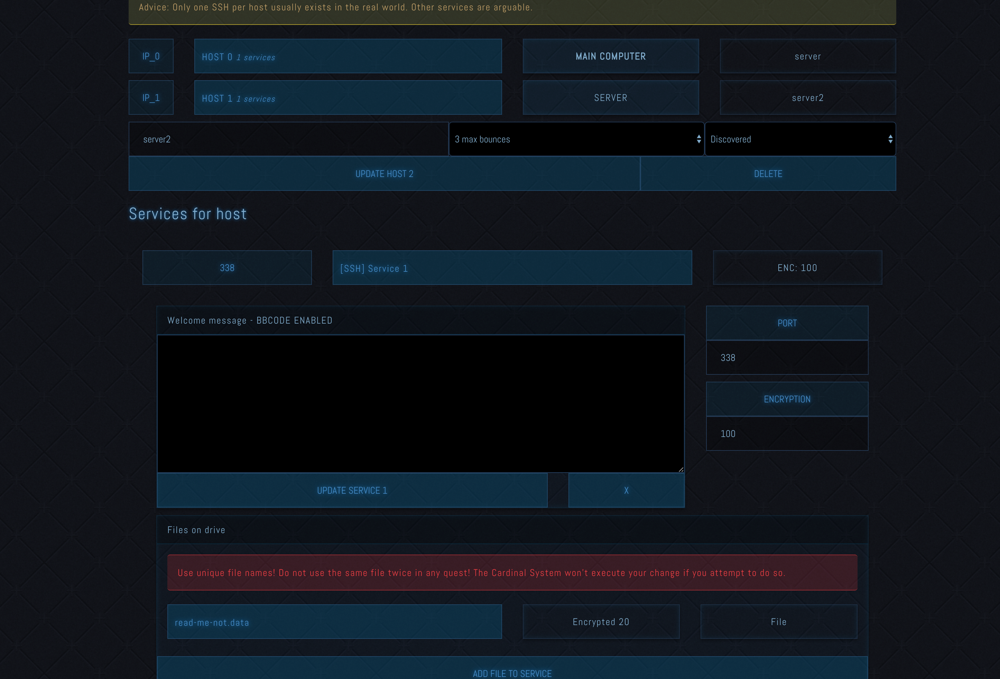
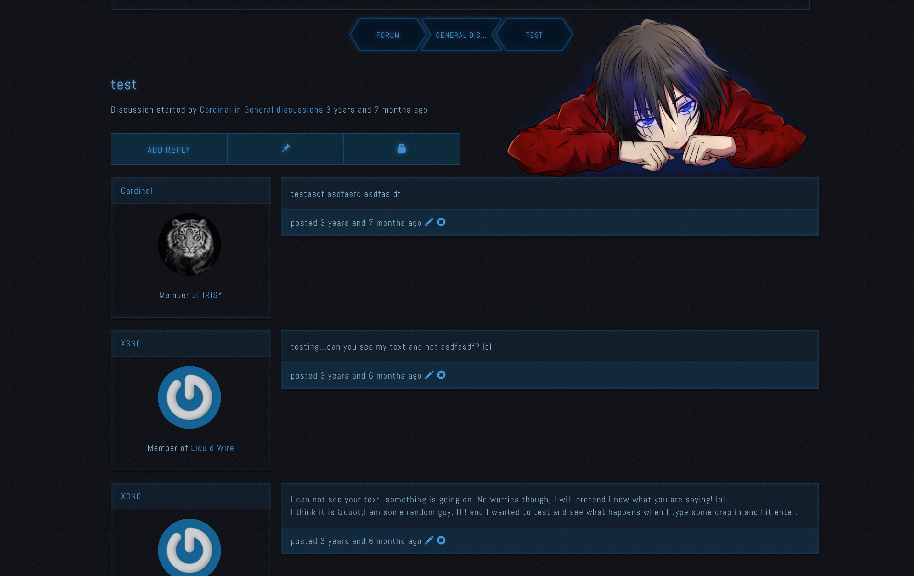

# Secret Republic - V3

See screens at the bottom.

The code for the Secret Republic hacker simulation role playing game V3.

Futuristic UI. Mission designer. Audio AI voice speaks when interacting with the game.

A lot of work has gone into this but it (and more in its previous version) is not a documented (as of yet) project.

It's been through years of development with this being its 3rd full do-over.

However, the project on stand-by so I've decided to make the source available of nothing else

Read more about the history of the game and the more complete older version in the works for open sourcing @ https://medium.com/@adrian.n/secret-republic-open-sourced-hacker-simulation-futuristic-rpg-browser-based-game-php-843d393cb9d7

# SecretAlpha V4 ( newer code, much less featured )

I probably recommend you try to run both versions or at least check out both repositories. V4 is newer, more responsive made with mobile-first in mind, but way less featured.

https://github.com/nenuadrian/Secret-Republic-Hacker-Game-ORPBG-Alpha

# Setting up

You can go with a light LAMP setup. Install MAMP (https://www.mamp.info/en/) for windows, WAMP (http://www.wampserver.com/en/) for Mac.

Import DB.sql into a fresh MySQL db.

Copy includes/database_info.template.php into includes/database_info.php and add your DB details.

Open includes/constants/constants.php and configure it if you want to setup email sending.

Run 'composer install' and 'composer update' (more info about composer: https://getcomposer.org/)

Create an account through the signup form and set your group_id to 1 inside the user_credentials DB table to become a Cardinal (admin).

# WARNING

Game currently works only if it is at the root of the domain. eg not localhost/game but localhost

# Cron jobs

Set these up to run periodically as the parameters suggest. The resources one should run maybe every minute

localhost/cron/key1/MDMwN2Q3OGRiYmM4Y2RkOWZjNTBmMzA4MzViZDZiNjQ=/attacks/true

localhost/cron/key1/MDMwN2Q3OGRiYmM4Y2RkOWZjNTBmMzA4MzViZDZiNjQ=/hourly/true

localhost/cron/key1/MDMwN2Q3OGRiYmM4Y2RkOWZjNTBmMzA4MzViZDZiNjQ=/daily/true

localhost/cron/key1/MDMwN2Q3OGRiYmM4Y2RkOWZjNTBmMzA4MzViZDZiNjQ=/hackdown/true

localhost/cron/key1/MDMwN2Q3OGRiYmM4Y2RkOWZjNTBmMzA4MzViZDZiNjQ/rankings/true

localhost/cron/key1/MDMwN2Q3OGRiYmM4Y2RkOWZjNTBmMzA4MzViZDZiNjQ=/attacks/true

e.g.

*/2 * * * * wget -O - http://localhost/cron/key1/MDMwN2Q3OGRiYmM4Y2RkOWZjNTBmMzA4MzViZDZiNjQ=/attacks/true >/dev/null 2>&1

https://en.wikipedia.org/wiki/Cron

# screens

# Read about the journey

https://medium.com/@adrian.n/secret-republic-open-sourced-hacker-simulation-futuristic-rpg-browser-based-game-php-843d393cb9d7

# License

This initial version was created by [Adrian Nenu] (https://github.com/nenuadrian) under [CC BY-SA 3.0 License](https://creativecommons.org/licenses/by-sa/3.0/)

Please link and contribute back to this repository if using the code or assets :)
